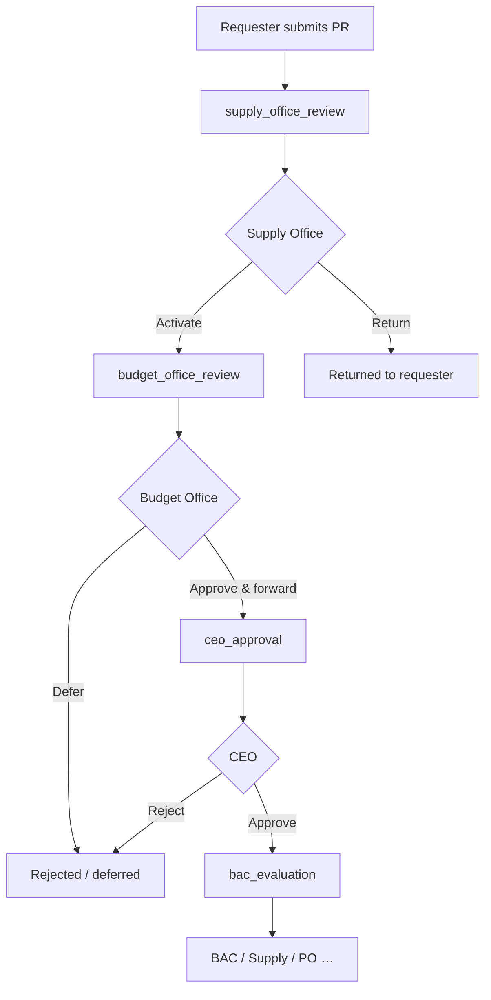

# CagSU Small Value Procurement (SVP) System

Web application for **purchase requests (PR)**, **budget earmarking**, **CEO and BAC workflows**, **quotations**, and **purchase orders** at **Cagayan State University — Sanchez Mira Campus**.

[](https://laravel.com)
[](https://php.net)
[](https://livewire.laravel.com)

---

## What it does

- **PR lifecycle** from department submission through supply screening, budget earmark, CEO decision, BAC activity, and supply/PO handling  
- **PPMP-linked line items**, attachments, activity timeline, and status notifications  
- **Budget Office** earmark data, object-of-expenditure rows, and **Excel earmark export** (PhpSpreadsheet)  
- **BAC Resolution** Word documents (PHPWord), generated when a PR is approved into BAC evaluation  
- **Role-based access** (Spatie Laravel Permission) with dashboards and Livewire-powered admin tables where used  
- **Reporting**, supplier registration, inventory receipts, accounting/disbursement hooks (see routes and menus)

---

## Stack

| Layer | Choices |
|--------|---------|
| Runtime | PHP **^8.2** |
| Framework | **Laravel 13** |
| UI | **Blade**, **Livewire 4**, **Alpine.js**, **Tailwind CSS 3**, **Vite 7** |
| Auth | Laravel Breeze (session), email verification, policies/gates + Spatie roles |
| Data | **MySQL** / MariaDB (typical); Eloquent ORM |
| Documents | **PHPWord** (DOCX), **PhpSpreadsheet** (XLSX) |
| Other | `kwn/number-to-words`, queues for notifications |

Dev dependencies include **Pint**, **Pail**, **PHPUnit 12**, **Laravel Boost**, **Sail** (optional).

---

## Requirements

- PHP **8.2+** with common extensions (`pdo_mysql`, `mbstring`, `openssl`, `json`, `zip` for spreadsheets/archives)  
- **Composer 2**  
- **Node.js 18+** (20+ recommended for Vite) and **npm**  
- **MySQL 5.7+** or **MariaDB 10.3+**  
- Writable **`storage/`** and **`bootstrap/cache/`**

---

## Quick start

```bash
git clone <repository-url>
cd CapstoneCAGSUSVPSystem

composer install
cp .env.example .env
php artisan key:generate
```

1. **Database** — Create a database and set `DB_*` in `.env`.  
2. **Migrate & seed** (demo data and roles):

   ```bash
   php artisan migrate --seed
   ```

3. **Front-end assets**

   ```bash
   npm install
   npm run build
   ```

4. **Run the app**

   ```bash
   php artisan serve
   ```

   Open `http://127.0.0.1:8000`. Health check: `GET /health` → JSON `status: ok`.

### One-command local dev

Runs HTTP server, queue worker, log tail (Pail), and Vite (needs `concurrently` via npm):

```bash
composer run dev
```

---

## Seeded demo logins

`php artisan migrate --seed` creates users via `ComprehensiveUserSeeder`. **Default password for all seeded users:** `password123` (change immediately outside local dev).

| Role (Spatie) | Example email |
|----------------|---------------|
| System Admin | `sysadmin@cagsu.edu.ph` |
| Supply Officer | `supply@cagsu.edu.ph` |
| Budget Office | `budget@cagsu.edu.ph` |
| Executive Officer (CEO PR queue) | `executive@cagsu.edu.ph` |
| BAC Secretary | `bac.secretary@cagsu.edu.ph` |
| BAC Chair / Vice / Members | `bac.chairman@cagsu.edu.ph`, etc. |
| Accounting | `accounting@cagsu.edu.ph` |
| Canvassing | `canvassing@cagsu.edu.ph` |
| Deans (per college) | Various `@csu.edu.ph` addresses in the seeder |

Full list: `database/seeders/ComprehensiveUserSeeder.php`.

---

## Purchase request flow (simplified)



- **Supply** activation creates a pending **Budget Office** approval (`WorkflowRouter`).  
- **Budget** approval sets earmark data and moves the PR to **CEO**.  
- **CEO** approval sets procurement method for SVP, assigns **resolution number**, generates **BAC Resolution DOCX** (best effort), and notifies **BAC Secretariat**.  

Detailed swimlanes and diagrams: [`docs/purchase-request-process-swimlane.md`](docs/purchase-request-process-swimlane.md).

---

## Document assets

| Output | Location / notes |
|--------|------------------|
| BAC Resolution DOCX | `storage/app/resolutions/` |
| Letterhead (optional) | `public/images/header.png`, `public/images/footer.png` (see existing docs in views/services) |
| Earmark Excel | Generated on demand from Budget earmark screens (`EarmarkExportService`) |

---

## Project layout (high level)

| Path | Purpose |
|------|---------|
| `app/Http/Controllers` | HTTP actions (PR, supply, budget, CEO, BAC, PO, reports, …) |
| `app/Livewire` | Interactive tables and widgets |
| `app/Services` | BAC resolution, earmark export, workflow, activity logging |
| `app/Models` | Eloquent models |
| `resources/views` | Blade UI |
| `routes/web.php` | Web routes and middleware groups |
| `database/seeders` | Roles, colleges, demo users |
| `tests` | PHPUnit feature & unit tests |

---

## Commands you will use

```bash
# Tests
composer test
# or
php artisan test

# Code style (dirty files)
vendor/bin/pint --dirty

# Clear caches
php artisan optimize:clear

# Queue worker (if not using composer run dev)
php artisan queue:work
```

If `php artisan test` fails on MySQL with foreign-key errors, confirm `phpunit.xml` / `.env.testing` match a clean test database, or switch the test connection to SQLite for local runs.

---

## Security & compliance

- Passwords hashed, CSRF on web forms, mass-assignment guarded models, authorization via policies/roles.  
- Designed around **RA 9184** and related IRR / COA / DBM guidance — **not** a legal certification; configure retention, backups, and access control for production.

---

## Documentation in this repo

- [`docs/purchase-request-process-swimlane.md`](docs/purchase-request-process-swimlane.md) — BPMN / swimlane / flowcharts  
- [`AGENTS.md`](AGENTS.md) — AI/agent and tooling notes  
- [`CLAUDE.md`](CLAUDE.md) — Laravel Boost–oriented guidelines  

Official framework docs: [laravel.com/docs](https://laravel.com/docs).

---

## License

Proprietary — developed for **Cagayan State University – Sanchez Mira Campus**. All rights reserved unless otherwise stated by the institution.

---

## Maintainer notes

- Bump this README when workflow or seed data changes.  
- Production: use strong passwords, HTTPS, scheduled backups, `APP_DEBUG=false`, and `php artisan config:cache` / `route:cache` / `view:cache` as appropriate.
