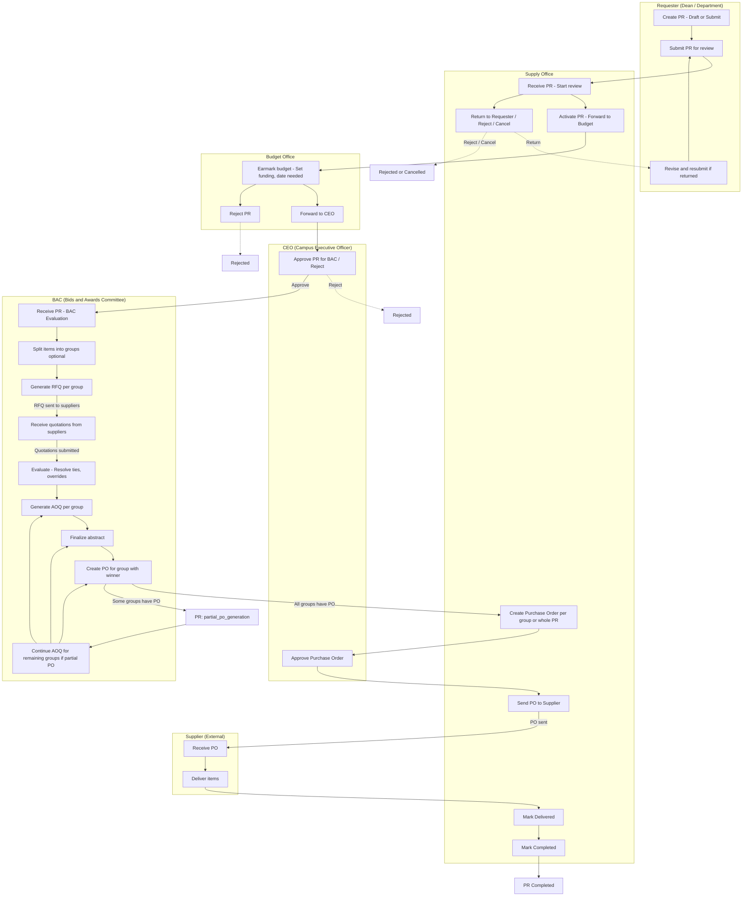

# CagSU-SVP Purchase Request Process — Swimlane Diagram

This document describes the current end-to-end Purchase Request (PR) workflow and who is responsible at each stage. The diagram uses Mermaid **flowchart with subgraphs** to represent swimlanes (one per actor).

## Process Overview

| Actor | Responsibility |
|-------|----------------|
| **Requester (Dean/Department)** | Creates PR (draft or submit), receives returned PR for revision |
| **Supply Office** | Initial review, activate/return/reject, create PO, send to supplier, mark delivered/complete |
| **Budget Office** | Earmark budget, set funding source, forward to CEO or reject |
| **CEO (Campus Executive Officer)** | Approve PR for BAC or reject; approves PO |
| **BAC (Bids and Awards Committee)** | Evaluation, RFQ, quotations, AOQ, finalize abstract; can create PO per group; continues BAC tasks for remaining groups during partial PO |
| **Supplier** | Receives PO, delivers items (external; actions recorded by Supply) |

---

## Swimlane Diagram (Mermaid)

---

## Status Flow (Linear View)

| Step | PR Status | Handler / Next |
|------|-----------|----------------|
| 1 | `draft` | Requester |
| 2 | `submitted` / `supply_office_review` | Supply Office |
| 3 | `budget_office_review` | Budget Office |
| 4 | `ceo_approval` | CEO |
| 5 | `bac_evaluation` | BAC |
| 6 | `bac_approved` or `partial_po_generation` | BAC (AOQ/PO) + Supply (create PO) |
| 7 | `po_generation` | Supply (create/send PO) |
| 8 | `po_approved` | CEO (approve PO) |
| 9 | `supplier_processing` | Supplier / Supply |
| 10 | `delivered` | Supply (mark delivered) |
| 11 | `completed` | Supply (mark completed) |

Exit statuses: `cancelled`, `rejected`, `returned_by_supply`.

---

## Partial PO / Grouped PR Flow (Current Behavior)

When a PR is split into **item groups**:

1. BAC evaluates and generates AOQ **per group**.
2. Supply/BAC creates a **PO for one group** when that group has a winner and AOQ.
3. PR status becomes **`partial_po_generation`** (some groups have PO, others do not).
4. **BAC can still** for remaining groups:
   - Generate AOQ (for groups without a PO),
   - Finalize abstract,
   - And then create PO for those groups.
5. When **all groups** have at least one PO, PR status becomes **`po_generation`**.

This is reflected in the swimlane by the loop: **BAC8 → Partial → BAC9 → BAC6/BAC7/BAC8**.

---

## How to View the Diagram

1. **VS Code / Cursor:** Use a Mermaid preview extension, or paste the code block into [Mermaid Live Editor](https://mermaid.live).
2. **GitHub/GitLab:** Render the fenced code block as Mermaid automatically in the repo.

File location: `docs/purchase-request-process-swimlane.md`
