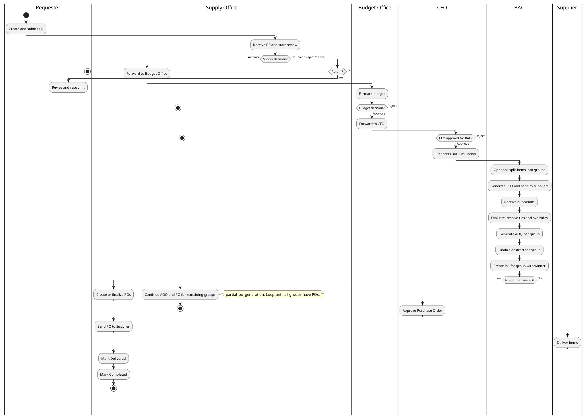
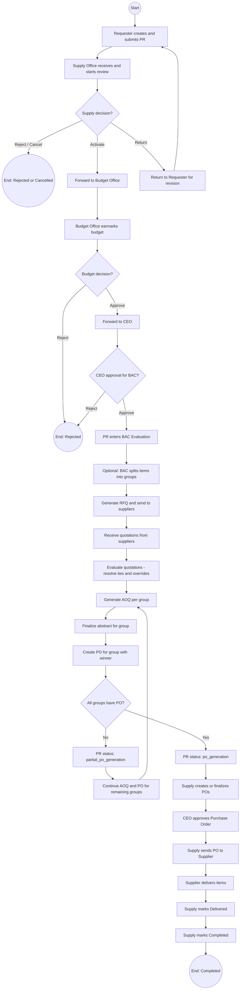

# CagSU-SVP Purchase Request Process

This document describes the PR workflow in three ways:

1. **BPMN diagram** — industry-standard process notation with horizontal swimlanes (one lane per actor).
2. **Swimlane diagram (PlantUML)** — true swimlanes (one lane per actor). Mermaid does not support native swimlanes.
3. **Flowchart (Mermaid)** — circle = Start/End, rectangle = process, diamond = decision.

## Process Overview (Actors)

| Actor | Responsibility |
|-------|----------------|
| **Requester (Dean/Department)** | Creates PR (draft or submit), receives returned PR for revision |
| **Supply Office** | Initial review, activate/return/reject, create PO, send to supplier, mark delivered/complete |
| **Budget Office** | Earmark budget, set funding source, forward to CEO or reject |
| **CEO (Campus Executive Officer)** | Approve PR for BAC or reject; approves PO |
| **BAC (Bids and Awards Committee)** | Evaluation, RFQ, quotations, AOQ, finalize abstract; create PO per group; continue BAC tasks for remaining groups during partial PO |
| **Supplier** | Receives PO, delivers items (external; actions recorded by Supply) |

---

## BPMN Diagram (BPMN 2.0 XML)

**BPMN (Business Process Model and Notation)** — industry-standard process modeling with horizontal swimlanes. Import this XML into [bpmn.io](https://bpmn.io/toolkit/), [Camunda Modeler](https://camunda.com/products/camunda-platform/modeler/), [draw.io](https://app.diagrams.net/) (File → Import → BPMN), or other BPMN tools.

```xml
<?xml version="1.0" encoding="UTF-8"?>
<bpmn2:definitions xmlns:bpmn2="http://www.omg.org/spec/BPMN/20100524/MODEL" 
                   xmlns:bpmndi="http://www.omg.org/spec/BPMN/20100524/DI" 
                   xmlns:dc="http://www.omg.org/spec/DD/20100524/DC" 
                   xmlns:di="http://www.omg.org/spec/DD/20100524/DI" 
                   id="Definitions" 
                   targetNamespace="http://cagsu-svp">
  
  <bpmn2:process id="PR-Process" name="Purchase Request Process" isExecutable="false">
    
    <!-- Lanes (Swimlanes) -->
    <bpmn2:laneSet id="LaneSet">
      <bpmn2:lane id="Lane_Requester" name="Requester">
        <bpmn2:flowNodeRef>StartEvent</bpmn2:flowNodeRef>
        <bpmn2:flowNodeRef>Task_CreatePR</bpmn2:flowNodeRef>
        <bpmn2:flowNodeRef>Task_ReviseResubmit</bpmn2:flowNodeRef>
      </bpmn2:lane>
      <bpmn2:lane id="Lane_Supply" name="Supply Office">
        <bpmn2:flowNodeRef>Task_ReceiveReview</bpmn2:flowNodeRef>
        <bpmn2:flowNodeRef>Gateway_SupplyDecision</bpmn2:flowNodeRef>
        <bpmn2:flowNodeRef>Task_CreatePO</bpmn2:flowNodeRef>
        <bpmn2:flowNodeRef>Task_SendPO</bpmn2:flowNodeRef>
        <bpmn2:flowNodeRef>Task_MarkDelivered</bpmn2:flowNodeRef>
        <bpmn2:flowNodeRef>Task_MarkCompleted</bpmn2:flowNodeRef>
      </bpmn2:lane>
      <bpmn2:lane id="Lane_Budget" name="Budget Office">
        <bpmn2:flowNodeRef>Task_EarmarkBudget</bpmn2:flowNodeRef>
        <bpmn2:flowNodeRef>Gateway_BudgetDecision</bpmn2:flowNodeRef>
      </bpmn2:lane>
      <bpmn2:lane id="Lane_CEO" name="CEO">
        <bpmn2:flowNodeRef>Gateway_CEODecision</bpmn2:flowNodeRef>
        <bpmn2:flowNodeRef>Task_ApprovePO</bpmn2:flowNodeRef>
      </bpmn2:lane>
      <bpmn2:lane id="Lane_BAC" name="BAC">
        <bpmn2:flowNodeRef>Task_BACEvaluation</bpmn2:flowNodeRef>
        <bpmn2:flowNodeRef>Task_SplitGroups</bpmn2:flowNodeRef>
        <bpmn2:flowNodeRef>Task_GenerateRFQ</bpmn2:flowNodeRef>
        <bpmn2:flowNodeRef>Task_ReceiveQuotations</bpmn2:flowNodeRef>
        <bpmn2:flowNodeRef>Task_EvaluateQuotations</bpmn2:flowNodeRef>
        <bpmn2:flowNodeRef>Task_GenerateAOQ</bpmn2:flowNodeRef>
        <bpmn2:flowNodeRef>Task_FinalizeAbstract</bpmn2:flowNodeRef>
        <bpmn2:flowNodeRef>Task_CreatePOGroup</bpmn2:flowNodeRef>
        <bpmn2:flowNodeRef>Gateway_AllGroupsPO</bpmn2:flowNodeRef>
        <bpmn2:flowNodeRef>Task_ContinueRemainingGroups</bpmn2:flowNodeRef>
      </bpmn2:lane>
      <bpmn2:lane id="Lane_Supplier" name="Supplier">
        <bpmn2:flowNodeRef>Task_DeliverItems</bpmn2:flowNodeRef>
      </bpmn2:lane>
    </bpmn2:laneSet>

    <!-- Start Event -->
    <bpmn2:startEvent id="StartEvent" name="Start"/>

    <!-- Tasks -->
    <bpmn2:task id="Task_CreatePR" name="Create and submit PR"/>
    <bpmn2:task id="Task_ReceiveReview" name="Receive PR and start review"/>
    <bpmn2:task id="Task_EarmarkBudget" name="Earmark budget"/>
    <bpmn2:task id="Task_BACEvaluation" name="PR enters BAC Evaluation"/>
    <bpmn2:task id="Task_SplitGroups" name="Optional: Split items into groups"/>
    <bpmn2:task id="Task_GenerateRFQ" name="Generate RFQ and send to suppliers"/>
    <bpmn2:task id="Task_ReceiveQuotations" name="Receive quotations"/>
    <bpmn2:task id="Task_EvaluateQuotations" name="Evaluate, resolve ties and overrides"/>
    <bpmn2:task id="Task_GenerateAOQ" name="Generate AOQ per group"/>
    <bpmn2:task id="Task_FinalizeAbstract" name="Finalize abstract for group"/>
    <bpmn2:task id="Task_CreatePOGroup" name="Create PO for group with winner"/>
    <bpmn2:task id="Task_ContinueRemainingGroups" name="Continue AOQ and PO for remaining groups"/>
    <bpmn2:task id="Task_CreatePO" name="Create or finalize POs"/>
    <bpmn2:task id="Task_ApprovePO" name="Approve Purchase Order"/>
    <bpmn2:task id="Task_SendPO" name="Send PO to Supplier"/>
    <bpmn2:task id="Task_DeliverItems" name="Deliver items"/>
    <bpmn2:task id="Task_MarkDelivered" name="Mark Delivered"/>
    <bpmn2:task id="Task_MarkCompleted" name="Mark Completed"/>
    <bpmn2:task id="Task_ReviseResubmit" name="Revise and resubmit"/>

    <!-- Gateways (Decisions) -->
    <bpmn2:exclusiveGateway id="Gateway_SupplyDecision" name="Supply decision?"/>
    <bpmn2:exclusiveGateway id="Gateway_BudgetDecision" name="Budget decision?"/>
    <bpmn2:exclusiveGateway id="Gateway_CEODecision" name="CEO approval for BAC?"/>
    <bpmn2:exclusiveGateway id="Gateway_AllGroupsPO" name="All groups have PO?"/>

    <!-- End Events -->
    <bpmn2:endEvent id="EndEvent_Completed" name="Completed"/>
    <bpmn2:endEvent id="EndEvent_Rejected" name="Rejected"/>
    <bpmn2:endEvent id="EndEvent_RejectedCancel" name="Rejected or Cancelled"/>

    <!-- Sequence Flows -->
    <bpmn2:sequenceFlow id="Flow_Start_CreatePR" sourceRef="StartEvent" targetRef="Task_CreatePR"/>
    <bpmn2:sequenceFlow id="Flow_CreatePR_ReceiveReview" sourceRef="Task_CreatePR" targetRef="Task_ReceiveReview"/>
    <bpmn2:sequenceFlow id="Flow_ReceiveReview_GatewaySupply" sourceRef="Task_ReceiveReview" targetRef="Gateway_SupplyDecision"/>
    
    <bpmn2:sequenceFlow id="Flow_SupplyActivate_Earmark" sourceRef="Gateway_SupplyDecision" targetRef="Task_EarmarkBudget" name="Activate"/>
    <bpmn2:sequenceFlow id="Flow_SupplyReturn_Revise" sourceRef="Gateway_SupplyDecision" targetRef="Task_ReviseResubmit" name="Return"/>
    <bpmn2:sequenceFlow id="Flow_SupplyReject_End" sourceRef="Gateway_SupplyDecision" targetRef="EndEvent_RejectedCancel" name="Reject/Cancel"/>
    <bpmn2:sequenceFlow id="Flow_Revise_CreatePR" sourceRef="Task_ReviseResubmit" targetRef="Task_CreatePR"/>

    <bpmn2:sequenceFlow id="Flow_Earmark_GatewayBudget" sourceRef="Task_EarmarkBudget" targetRef="Gateway_BudgetDecision"/>
    <bpmn2:sequenceFlow id="Flow_BudgetApprove_CEODecision" sourceRef="Gateway_BudgetDecision" targetRef="Gateway_CEODecision" name="Approve"/>
    <bpmn2:sequenceFlow id="Flow_BudgetReject_End" sourceRef="Gateway_BudgetDecision" targetRef="EndEvent_Rejected" name="Reject"/>

    <bpmn2:sequenceFlow id="Flow_CEOApprove_BACEval" sourceRef="Gateway_CEODecision" targetRef="Task_BACEvaluation" name="Approve"/>
    <bpmn2:sequenceFlow id="Flow_CEOReject_End" sourceRef="Gateway_CEODecision" targetRef="EndEvent_Rejected" name="Reject"/>

    <bpmn2:sequenceFlow id="Flow_BACEval_SplitGroups" sourceRef="Task_BACEvaluation" targetRef="Task_SplitGroups"/>
    <bpmn2:sequenceFlow id="Flow_SplitGroups_GenerateRFQ" sourceRef="Task_SplitGroups" targetRef="Task_GenerateRFQ"/>
    <bpmn2:sequenceFlow id="Flow_GenerateRFQ_ReceiveQuotations" sourceRef="Task_GenerateRFQ" targetRef="Task_ReceiveQuotations"/>
    <bpmn2:sequenceFlow id="Flow_ReceiveQuotations_Evaluate" sourceRef="Task_ReceiveQuotations" targetRef="Task_EvaluateQuotations"/>
    <bpmn2:sequenceFlow id="Flow_Evaluate_GenerateAOQ" sourceRef="Task_EvaluateQuotations" targetRef="Task_GenerateAOQ"/>
    <bpmn2:sequenceFlow id="Flow_GenerateAOQ_Finalize" sourceRef="Task_GenerateAOQ" targetRef="Task_FinalizeAbstract"/>
    <bpmn2:sequenceFlow id="Flow_Finalize_CreatePOGroup" sourceRef="Task_FinalizeAbstract" targetRef="Task_CreatePOGroup"/>
    <bpmn2:sequenceFlow id="Flow_CreatePOGroup_GatewayAllGroups" sourceRef="Task_CreatePOGroup" targetRef="Gateway_AllGroupsPO"/>

    <bpmn2:sequenceFlow id="Flow_AllGroupsYes_CreatePO" sourceRef="Gateway_AllGroupsPO" targetRef="Task_CreatePO" name="Yes"/>
    <bpmn2:sequenceFlow id="Flow_AllGroupsNo_Continue" sourceRef="Gateway_AllGroupsPO" targetRef="Task_ContinueRemainingGroups" name="No"/>
    <bpmn2:sequenceFlow id="Flow_Continue_GenerateAOQ" sourceRef="Task_ContinueRemainingGroups" targetRef="Task_GenerateAOQ"/>

    <bpmn2:sequenceFlow id="Flow_CreatePO_ApprovePO" sourceRef="Task_CreatePO" targetRef="Task_ApprovePO"/>
    <bpmn2:sequenceFlow id="Flow_ApprovePO_SendPO" sourceRef="Task_ApprovePO" targetRef="Task_SendPO"/>
    <bpmn2:sequenceFlow id="Flow_SendPO_DeliverItems" sourceRef="Task_SendPO" targetRef="Task_DeliverItems"/>
    <bpmn2:sequenceFlow id="Flow_DeliverItems_MarkDelivered" sourceRef="Task_DeliverItems" targetRef="Task_MarkDelivered"/>
    <bpmn2:sequenceFlow id="Flow_MarkDelivered_MarkCompleted" sourceRef="Task_MarkDelivered" targetRef="Task_MarkCompleted"/>
    <bpmn2:sequenceFlow id="Flow_MarkCompleted_End" sourceRef="Task_MarkCompleted" targetRef="EndEvent_Completed"/>

  </bpmn2:process>

  <bpmndi:BPMNDiagram id="BPMNDiagram">
    <bpmndi:BPMNPlane id="BPMNPlane" bpmnElement="PR-Process"/>
  </bpmndi:BPMNDiagram>

</bpmn2:definitions>
```

**How to use:**
1. Copy the XML above
2. Open [bpmn.io](https://demo.bpmn.io/) or [Camunda Modeler](https://camunda.com/products/camunda-platform/modeler/)
3. Import the XML (File → Import → BPMN/XML)
4. The tool will render the swimlanes and flow automatically
5. Export as PNG/SVG/PDF

*Note: The XML above defines the process structure (lanes, tasks, gateways, flows). BPMN tools will auto-generate the visual layout. For a fully styled diagram, use a BPMN modeling tool to arrange elements visually.*

---

## Swimlane Diagram (PlantUML)

**True swimlanes:** each column is one actor. Use [PlantUML Online](https://www.plantuml.com/plantuml/uml/), the VS Code “PlantUML” extension, or paste the code into a `.puml` file and export to PNG/SVG.



*PlantUML activity diagrams use **vertical swimlanes** (one column per actor). Render at [plantuml.com](https://www.plantuml.com/plantuml/uml/) or with the PlantUML VS Code extension.*

---

## Flowchart (Mermaid) — No Swimlanes

Mermaid has no native swimlane support; this is a single-pool flowchart with shapes.



---

## Status Flow (Linear View)

| Step | PR Status | Handler / Next |
|------|-----------|----------------|
| 1 | `draft` | Requester |
| 2 | `submitted` / `supply_office_review` | Supply Office |
| 3 | `budget_office_review` | Budget Office |
| 4 | `ceo_approval` | CEO |
| 5 | `bac_evaluation` | BAC |
| 6 | `bac_approved` or `partial_po_generation` | BAC (AOQ/PO) + Supply (create PO) |
| 7 | `po_generation` | Supply (create/send PO) |
| 8 | `po_approved` | CEO (approve PO) |
| 9 | `supplier_processing` | Supplier / Supply |
| 10 | `delivered` | Supply (mark delivered) |
| 11 | `completed` | Supply (mark completed) |

Exit statuses: `cancelled`, `rejected`, `returned_by_supply`.

---

## Partial PO / Grouped PR Flow (Current Behavior)

When a PR is split into **item groups**:

1. BAC evaluates and generates AOQ **per group**.
2. Supply/BAC creates a **PO for one group** when that group has a winner and AOQ.
3. PR status becomes **`partial_po_generation`** (some groups have PO, others do not).
4. **BAC can still** for remaining groups:
   - Generate AOQ (for groups without a PO),
   - Finalize abstract,
   - And then create PO for those groups.
5. When **all groups** have at least one PO, PR status becomes **`po_generation`**.

This is reflected in the flowchart by the decision **All groups have PO?** and the loop: **R → S → T → O** (continue AOQ/PO for remaining groups until all have POs).

---

## How to View the Diagrams

| Format | How to view |
|--------|--------------|
| **BPMN (swimlane)** | Import XML into [bpmn.io](https://demo.bpmn.io/), [Camunda Modeler](https://camunda.com/products/camunda-platform/modeler/), or [draw.io](https://app.diagrams.net/) (File → Import → BPMN). Export as PNG/SVG/PDF. |
| **PlantUML (swimlane)** | [PlantUML Online Server](https://www.plantuml.com/plantuml/uml/) — paste the PlantUML code and export PNG/SVG. Or use the **PlantUML** extension in VS Code/Cursor. |
| **Mermaid (flowchart)** | [Mermaid Live Editor](https://mermaid.live) or a Mermaid preview extension. GitHub/GitLab render Mermaid in markdown. |

File: `docs/purchase-request-process-swimlane.md`
